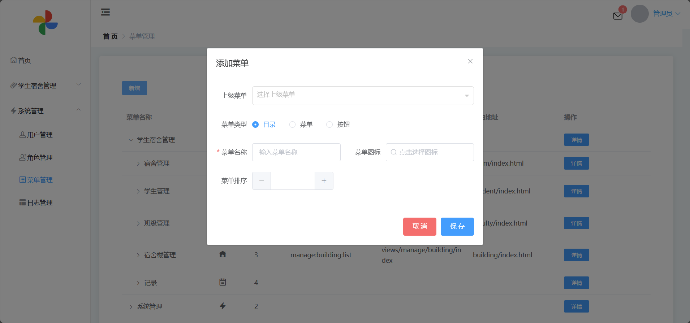
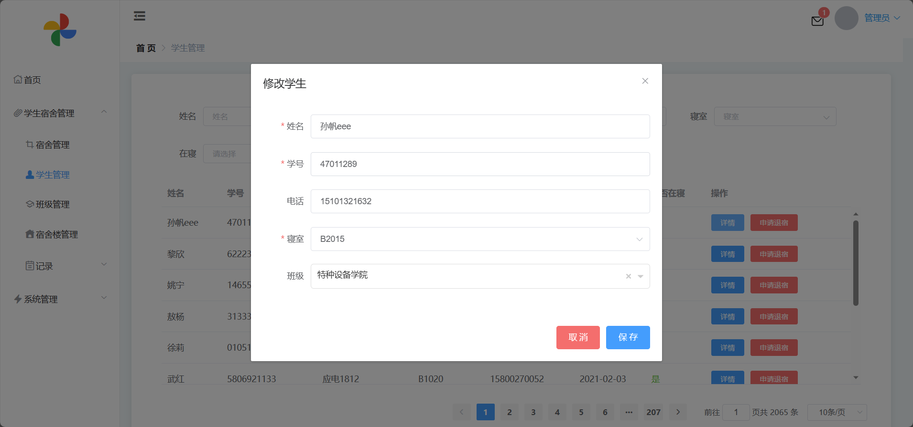

<h1 align="center">基于SSM的宿舍管理系统</h1>

 获取sql文件 QQ: 386869957 QQ群: 377586148 

 [个人站点: 从戎源码网](https://armycodes.com/)

## 简介

> 本代码来源于网络,仅供学习参考使用!
>
> 提供1.远程部署/2.修改代码/3.设计文档指导/4.框架代码讲解等服务
>
> 前端首页：http://localhost:8087
>
> 管理员: admin 密码: 123456
>
> 宿管：279a797a 密码: 123456
>

## 项目介绍

基于SSM的宿舍管理系统：前端 ElementUI、Vue、Axios，后端 SpringBoot、Mybatis、Redis，系统角色分为：超级管理员、管理员和宿管，超级管理员在管理后台管理宿舍、学生和班级，以及系统管理等；管理员对系统进行管理，如用户、菜单、角色等；宿管对学生进行管理等。主要功能如下：

### 启动方式

- 前端：
> cd vue
>
> npm install
>
> npm run dev

- 后端：
> 启动Redis | 启动redis-server.exe
> 
> 按钮启动 | 右键run MyprojectApplication

### 超级管理员：

- 基本操作：登录、修改密码、获取个人信息、修改个人信息
- 通知管理：获取通知列表、发送通知、查看通知、删除通知
- 退宿管理：获取退宿列表、审批退宿、查看审核记录
- 宿舍管理：筛选宿舍、获取宿舍列表、查看宿舍信息详情、新增宿舍信息、删除宿舍信息、修改宿舍信息
- 学生管理：筛选学生信息、新增学生信息、查看学生信息详情、申请退宿、修改学生信息
- 班级管理：添加班级、获取班级列表、查看学生、修改信息、删除信息
- 宿舍楼管理：新增宿舍楼、查看宿舍楼详情、删除宿舍信息
- 维修记录管理：发布维修记录、获取维修记录列表、筛选维修记录、删除维修记录、查看记录详情、确定维修情况
- 晚归记录管理：获取晚归记录列表、新增晚归记录、删除晚归记录、查看晚归记录详情、筛选晚归记录、修改晚归记录信息
- 请假记录管理：获取请假记录列表、新增请假记录、筛选请假记录、删除请假记录、查看请假记录详情、修改请假记录信息、确定返校
- 用户管理：筛选用户信息、查看用户信息详情、删除用户信息、对指定用户发送消息、新增用户、获取用户在线状态
- 角色管理：新增角色、查看角色权限、删除角色、筛选角色、获取角色列表
- 菜单管理：新增菜单信息、获取菜单信息列表、查看菜单信息详情
- 日志管理：筛选日志信息、获取日志列表、查看日志详情

### 管理员：

- 基本操作：登录、修改密码、获取个人信息、修改个人信息
- 通知管理：获取通知列表、发送通知、查看通知、删除通知
- 退宿管理：获取退宿列表、审批退宿、查看审核记录
- 用户管理：筛选用户信息、查看用户信息详情、删除用户信息、对指定用户发送消息、新增用户、获取用户在线状态
- 角色管理：新增角色、查看角色权限、删除角色、筛选角色、获取角色列表
- 菜单管理：新增菜单信息、获取菜单信息列表、查看菜单信息详情
- 日志管理：筛选日志信息、获取日志列表、查看日志详情

### 宿管：

- 基本操作：登录、修改密码、获取个人信息、修改个人信息
- 通知管理：获取通知列表、发送通知、查看通知、删除通知
- 退宿管理：获取退宿列表、审批退宿、查看审核记录
- 宿舍管理：筛选宿舍、获取宿舍列表、查看宿舍信息详情
- 学生管理：筛选学生信息、查看学生信息详情、申请退宿
- 班级管理：添加班级、获取班级列表、查看学生
- 维修记录管理：发布维修记录、获取维修记录列表、筛选维修记录、查看记录详情、确定维修情况
- 晚归记录管理：获取晚归记录列表、新增晚归记录、删除晚归记录、查看晚归记录详情、筛选晚归记录、修改晚归记录信息
- 请假记录管理：获取请假记录列表、新增请假记录、筛选请假记录、删除请假记录、查看请假记录详情、修改请假记录信息、确定返校

## 环境

- <b>IntelliJ IDEA 2020.3</b>

- <b>Mysql 5.7.26</b>

- <b>NodeJs 14.17.3</b>

- <b>Maven 3.6.3</b>
  
- <b>Redis 3.2.100及以上</b>

- <b>JDK 1.8</b>

## 运行截图

